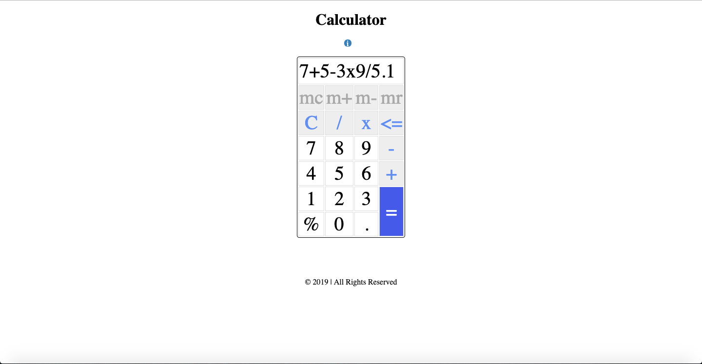

# Calculator

### How to start
> 1. To open the app go to the project's download folder
> 2. Right click on the file name _index.html_
> 3. Click on the _open with_ option
> 4. Chose a browser to use the app in

### How to use
> 1. Click on the buttons to form the desired equation
> 2. Click the equals button to get the result
> 3. Click the info button knowledge on the buttons on the top row

### Requirements
- This game requires a browser to run
- The browser needs to have Javascipt available and enabled

### Preview

**Thank you for downloading this project :)**